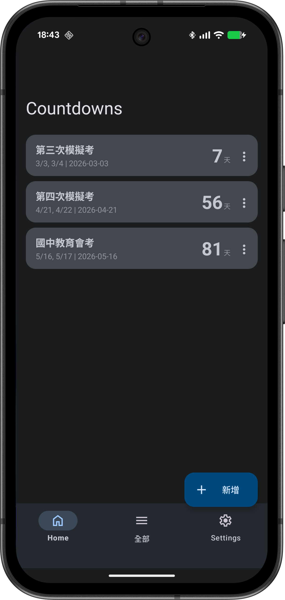
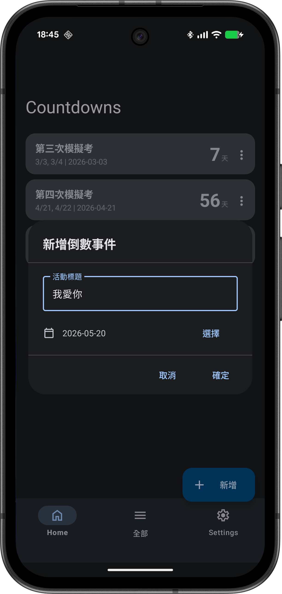
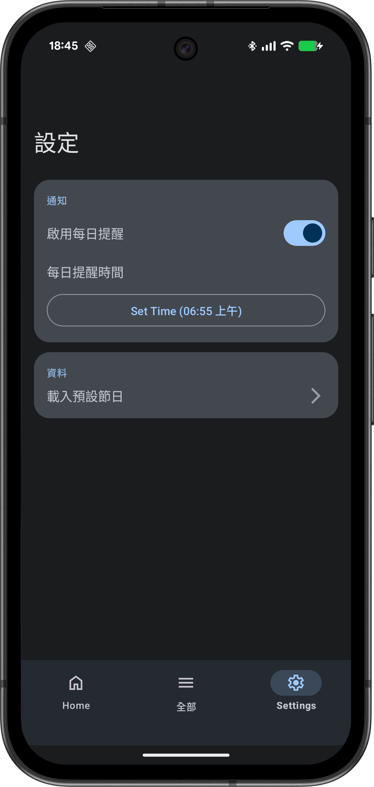

# 將[klhrd](https://github.com/klhrd)的[count_down](https://github.com/klhrd/tools/tree/main/count_down)移植到 Android平台

## Countdown_android
### 專案概覽
* 此專案由 Gemini CLI 運行於 Android Studio ，協助開發。
* 用戶可訂定 <strong>活動</strong> 並設定日期，APP會於每日用戶設定之時間發送通知提醒用戶該活動距離當日剩餘多少天。

### 專案由來
* 繼 [klhrd](https://github.com/klhrd) 開發之 [count_down](https://github.com/klhrd/tools/tree/main/count_down) 專案，使用瀏覽器 <strong>PWA</strong> 技術，試圖使用瀏覽器通知功能，達到在用戶設定之活動將至時，通知用戶。然而該通知功能僅在開啟網頁時適用，用戶關閉網頁後即失效。

## APP 截圖

* APP 首頁
  

 
* APP 新增活動
  

* APP 設定
  
